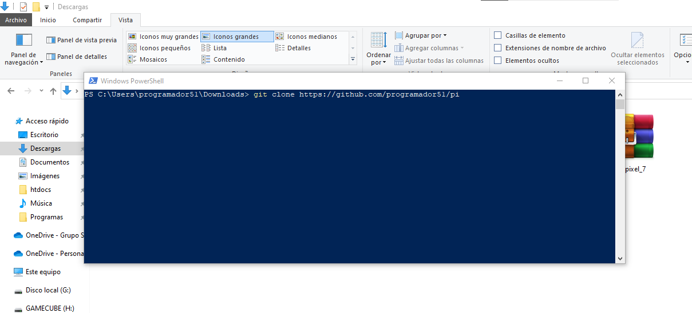
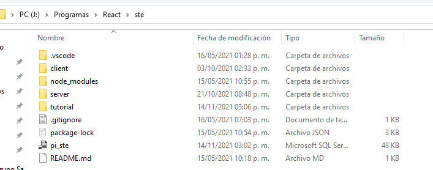

**Indice**

1. [Requisitos para iniciar el codigo](#requirements)
2. [Descargar el codigo](#download)
3. [Iniciar la base de datos](#db)

# ¿ Como iniciar el proyecto (local) ?

## Requisitos

- Tener nodejs instalado
- Tener XAMPP instalado (para correr una base de datos en mysql)

## Descargar el proyecto

---

1. En cualquier carpeta del S.O. abrir una terminal (cual sea) y ejecutar el siguiente comando: `git clone https://github.com/programador51/pi`

Debe dar como resultado la siguiente estructura de carpetas, `client` y `server`.

---

2. Ejecutar el siguiente comando **EN LA RAIZ** de los de la carpeta `client` y `server`: `npm i`.

## Iniciar la base de datos

1. Ejecutar Apache y MySQL con XAMPP.
2. Abrir el gestor de base de datos `MySQL` e importar la base de datos. **Se debe llamar `pi_ste`.** El archivo se encuentra en la raiz de este repositorio y se llama `pi_ste.sql`.

## Iniciar el servidor

1. Abrir la carpeta `server` de este repositorio en la terminal del S.O.
2. Ejectuar el comando `npm run server`

## Iniciar el cliente

1. Abrir la carpeta `client` da este repositorio
2. Ejecutar el comando `npm start`
